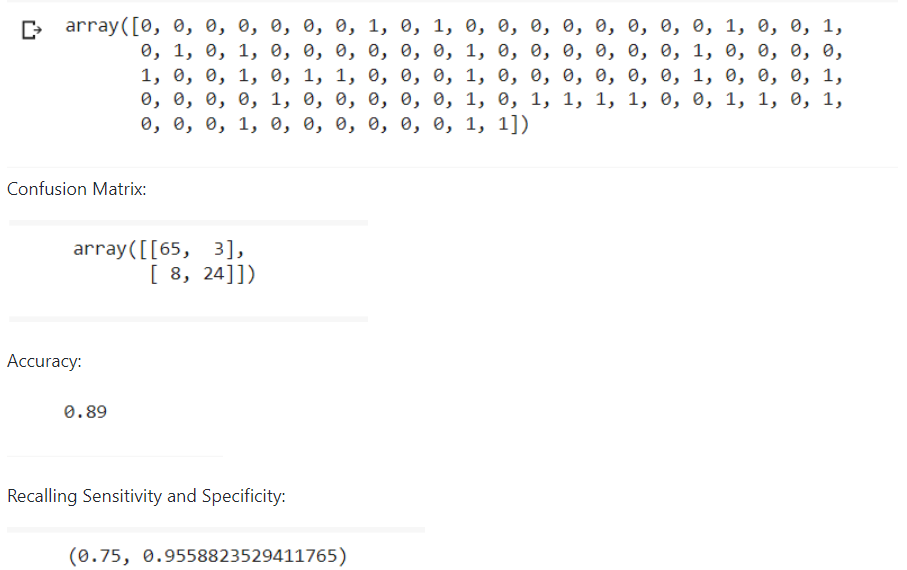
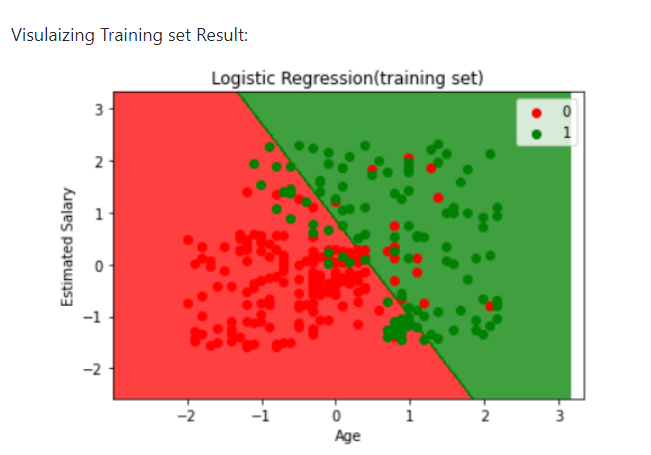

# Implementation-of-Logistic-Regression-Using-Gradient-Descent

## AIM:
To write a program to implement the the Logistic Regression Using Gradient Descent.

## Equipments Required:
1. Hardware – PCs
2. Anaconda – Python 3.7 Installation / Moodle-Code Runner

## Algorithm
1. 
2. 
3. 
4. 

## Program:
```
/*
Program to implement the the Logistic Regression Using Gradient Descent.
Developed by: 
RegisterNumber:  
*/
import numpy as np
import matplotlib.pyplot as plt
import pandas as pd
df = pd.read_csv("Social_Network_Ads(1).csv")
x = df.iloc[:, [2,3]].values
y = df.iloc[:, 4].values

#fitting the dataset into the training set and test set
from sklearn.model_selection import train_test_split
x_train,x_test,y_train,y_test = train_test_split(x,y,test_size = 0.25,random_state=0)

#feature scaling
from sklearn.preprocessing import StandardScaler
st_x = StandardScaler()
st_x

x_train = st_x.fit_transform(x_train)
x_test = st_x.transform(x_test)

#fitting the logistic regression into the training set
from sklearn.linear_model import LogisticRegression
classifier = LogisticRegression(random_state=0)
classifier.fit(x_train,y_train)

#prediction the test and result
Y_pred = classifier.predict(x_test)
Y_pred

#Making the confusion matrix
from sklearn.metrics import confusion_matrix
cm = confusion_matrix(y_test,Y_pred)
cm

from sklearn import metrics
accuracy = metrics.accuracy_score(y_test,Y_pred)
accuracy

recall_sensitivity = metrics.recall_score(y_test,Y_pred,pos_label=1)
recall_specificity = metrics.recall_score(y_test,Y_pred,pos_label=0)
recall_sensitivity, recall_specificity

#visualizing the training set results
from matplotlib.colors import ListedColormap
x_set,y_set = x_train,y_train
x1,x2=np.meshgrid(np.arange(start = x_set[:,0].min()-1, stop=x_set[:,0].max()+1,step=0.01),
                  np.arange(start = x_set[:,1].min()-1, stop=x_set[:,1].max()+1,step=0.01))

plt.contourf(x1,x2,classifier.predict(np.array([x1.ravel(),x2.ravel()]).T).reshape(x1.shape),alpha=0.75,cmap=ListedColormap(('red','green')))
plt.xlim(x1.min(),x2.max())
plt.ylim(x2.min(),x2.max())
for i,j in enumerate(np.unique(y_set)):
    plt.scatter(x_set[y_set == j,0],x_set[y_set==j,1],
                c=ListedColormap(('red','green'))(i),label=j)
plt.title('Logistic Regression(training set)')
plt.xlabel("Age")
plt.ylabel("Estimated Salary")
plt.legend()
plt.show()
```

## Output:




## Result:
Thus the program to implement the the Logistic Regression Using Gradient Descent is written and verified using python programming.

